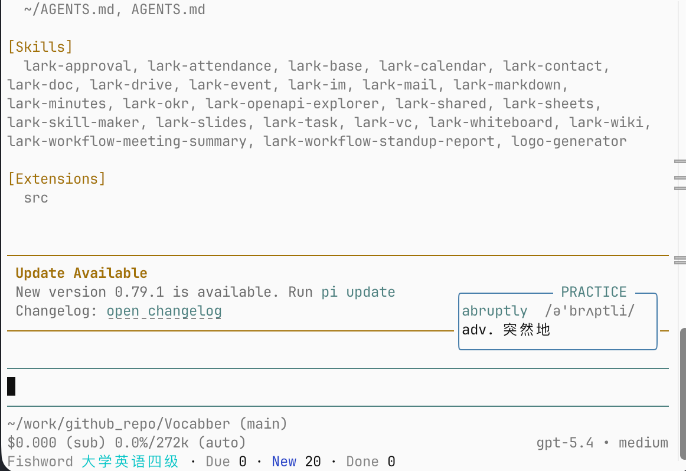
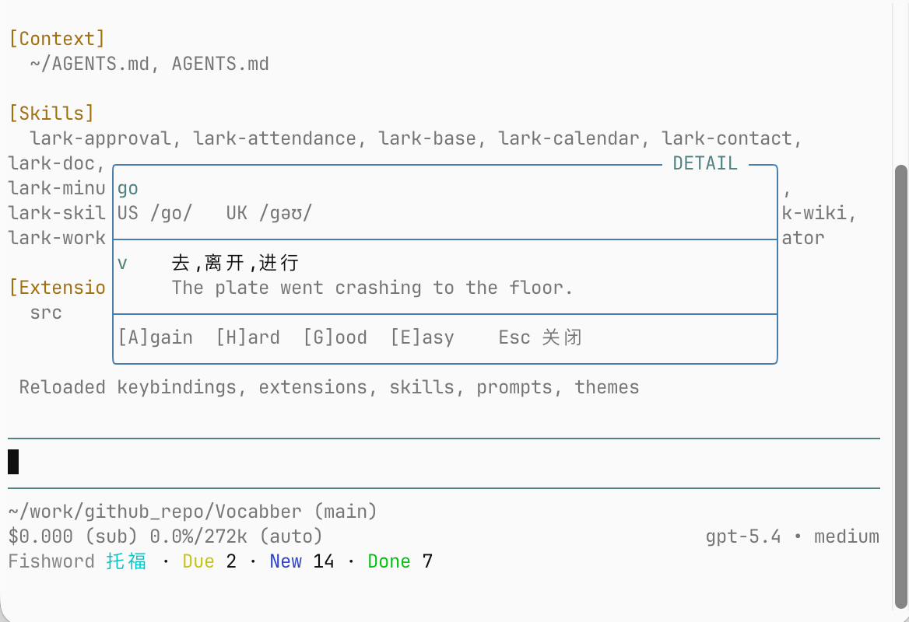
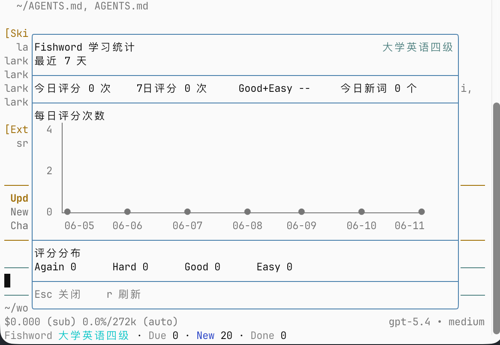
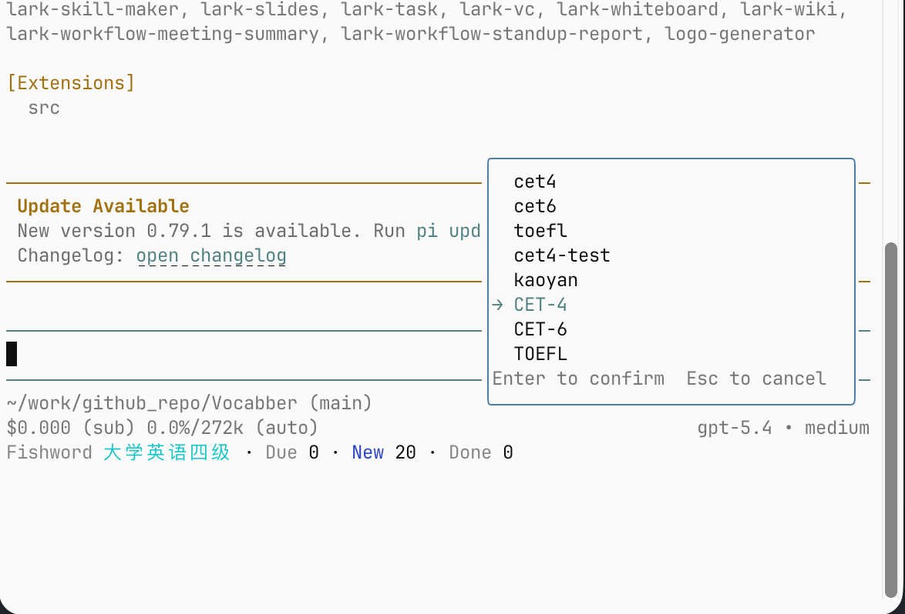

# Fishword

> 本地优先的间隔重复词汇学习工具，CLI 驱动，可嵌入任意开发环境。

[](https://www.npmjs.com/package/@fishword/pi-extension)
[](#许可证)

Fishword 使用 [FSRS](https://github.com/open-spaced-repetition/fsrs4anki/wiki/The-Algorithm) 算法调度复习，数据完全存储在本地 SQLite，无需联网。你可以通过 CLI 直接使用，也可以通过集成接入到你的开发环境中。

Fishword 面向 Vibe Coding 场景：当你在 Pi.dev 里等待 AI 回复、命令执行或测试完成时，可以直接在开发环境中顺手复习单词。

> 代码让 AI 慢慢生成，单词我先偷偷记几个。

本项目认可并感谢 [LINUX DO](https://linux.do/) 社区。

---

## 当前集成：Pi 编程助手

[观看 Pi 扩展演示视频](https://media.githubusercontent.com/media/Chenggou1/fishword/main/docs/videos/pi-extension-demo.mp4)

### 安装

```
pi install npm:@fishword/pi-extension
```

重启 Pi 后，扩展自动完成初始化——创建并导入三个内置词库：

| 词库 | 词条数 |
|------|--------|
| CET-4 | 4,544 |
| CET-6 | 3,992 |
| TOEFL | 10,377 |

默认激活 CET-4，无需任何配置，打开 Pi 即可开始复习。

### 复习单词



按 **`Ctrl+Shift+V`** 显示当前词卡，然后用快捷键评分：

| 快捷键 | 评分 | 含义 |
|--------|------|------|
| `Ctrl+Shift+G` | good | 记住了 |
| `Ctrl+Shift+H` | hard | 有点难 |
| `Ctrl+Shift+A` | again | 没记住，下次再来 |
| `Ctrl+Shift+E` | easy | 轻松，拉长复习间隔 |

评分后自动显示下一张，FSRS 算法根据你的表现动态调整复习时间。

### 详细信息面板



按 **`Ctrl+Shift+I`** 打开详情面板，展示完整音标（US / UK）、词性、释义和例句。在面板内可直接评分并自动切换到下一张——支持字母快捷键 `A` / `H` / `G` / `E`，也支持原有的 `Ctrl+Shift+` 组合键。按 `Esc` 关闭面板并返回词卡视图。

### 查看学习统计



输入 `/fw-stats` 查看今日完成量、学习新词数和 7 日学习趋势。

### 词库与算法独立性

每个词库都有**独立的 FSRS 调度状态**——CET-4 的复习进度不会影响 CET-6，反之亦然。你可以同时维护多个词库，在不同学习目标之间自由切换，算法会分别记住你对每个词的掌握程度。

例如：备考四级时激活 CET-4，考完后切换到 TOEFL 备考托福，两套进度互不干扰。

### 切换词库

输入 `/fw-deck` 打开词库选择器：



选中后立即生效，词卡和统计均切换到对应词库。也可以通过 `/fw-deck` 导入自定义词汇文件（支持 CSV / JSONL / Anki TSV 格式）。

---

## 开发文档

如需二次开发、构建或接入新的集成，请参阅 [docs/development.md](docs/development.md)。

---

## 许可证

[GPL-3.0-only](LICENSE)
